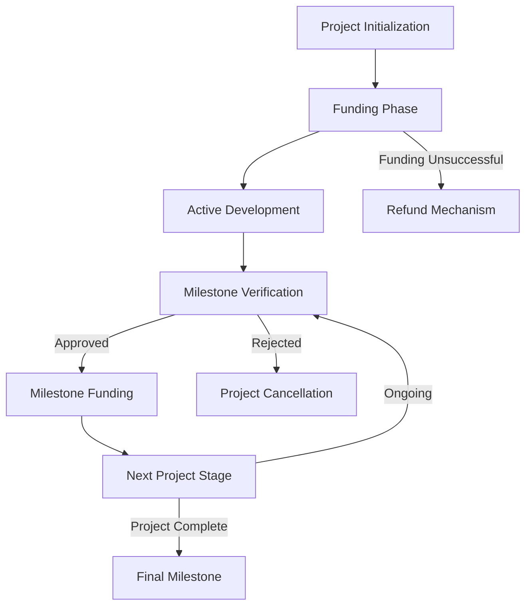

# Shield Factory: Decentralized Project Funding Platform

A blockchain-powered platform enabling creators to secure milestone-based funding with robust transparency and accountability mechanisms.

## Overview

Shield Factory introduces an innovative phased funding release system where creators receive project funds through verified, incremental milestones. This revolutionary approach ensures:

- Transparent project progression
- Risk mitigation for backers
- Flexible funding verification methods
- Secure, programmable fund distribution
- Enhanced creator-backer alignment



## Architecture

A sophisticated smart contract managing:

1. Project Registration
2. Dynamic Funding Mechanisms
3. Milestone Tracking
4. Verification Protocols
5. Secure Fund Management

### Core Components

- **Project Registry**: Comprehensive project metadata tracking
- **Milestone Tracking**: Granular project progression monitoring
- **Dual Verification**: Community voting or expert reviewer validation
- **Financial Management**: Secure, transparent token handling
- **Risk Protection**: Advanced refund and cancellation frameworks

## Key Features

### Flexible Verification Models
- Community-driven voting mechanism
- Expert reviewer validation
- Configurable milestone criteria

### Funding Dynamics
- Incremental fund releases
- Transparent progress tracking
- Platform fee optimization

### Security Foundations
- Blockchain-enforced accountability
- Programmable fund distribution
- Immutable verification records

## Getting Started

### Requirements
- Clarinet
- Stacks Wallet
- STX Tokens

### Quick Setup

1. Clone repository
2. Install dependencies
3. Deploy smart contract

### Basic Interaction

```clarity
;; Create Project
(contract-call? .shield-factory create-project 
    "Innovative Technology" 
    "Groundbreaking tech solution" 
    u500000     ;; Funding Goal
    u0          ;; Voting Verification
    u1500)      ;; Funding Deadline

;; Add Project Milestone
(contract-call? .shield-factory add-milestone
    u1          ;; Project ID
    "Prototype" 
    "Initial product development"
    u30         ;; Funding Percentage
    u2000)      ;; Milestone Deadline
```

## Development

### Testing
```bash
clarinet test
```

### Local Deployment
```bash
clarinet console
```

## Security Considerations

- Funds locked until milestone verification
- Multiple verification pathways
- Transparent fund management
- Built-in refund mechanisms

## License

[Specify your license]